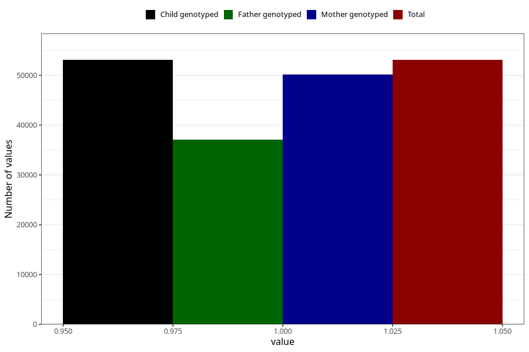

# delayed_speech_development_no_18m
Variable mapping to `EE839` in `Skjema5_18mnd_v12`.
- Number of values:

| Value | Total | Child genotyped | Mother genotyped | Father genotyped |
| ----- | ----- | --------------- | ---------------- | ---------------- |
| Missing | 27915 | 27915 | 26391 | 16565 |
| Non-missing | 53090 | 53090 | 50226 | 37039 |
| 1 | 53090 | 53090 | 50226 | 37039 |

