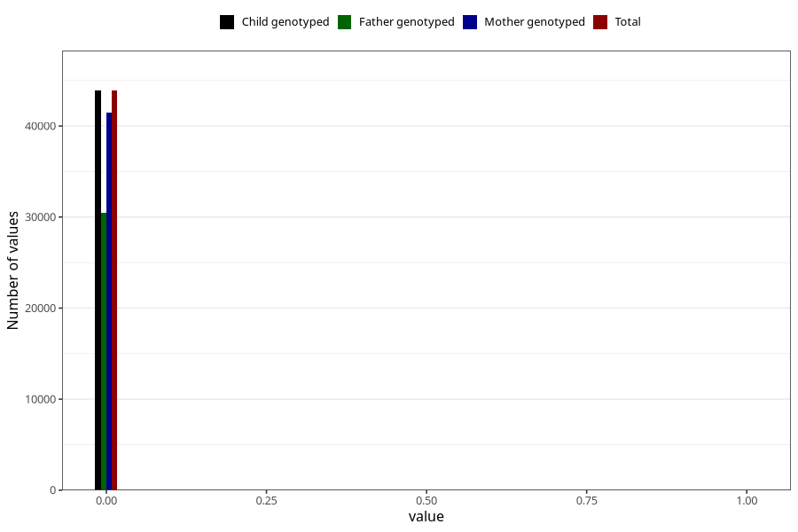

# diabetes_3y
Variable created during phenotype curation.
- Number of values:

| Value | Total | Child genotyped | Mother genotyped | Father genotyped |
| ----- | ----- | --------------- | ---------------- | ---------------- |
| Missing | 37095 | 37095 | 35081 | 23106 |
| Non-missing | 43910 | 43910 | 41536 | 30498 |
| 0 | 43884 | 43884 | 41510 | 30479 |
| 1 | 26 | 26 | 26 | 19 |

