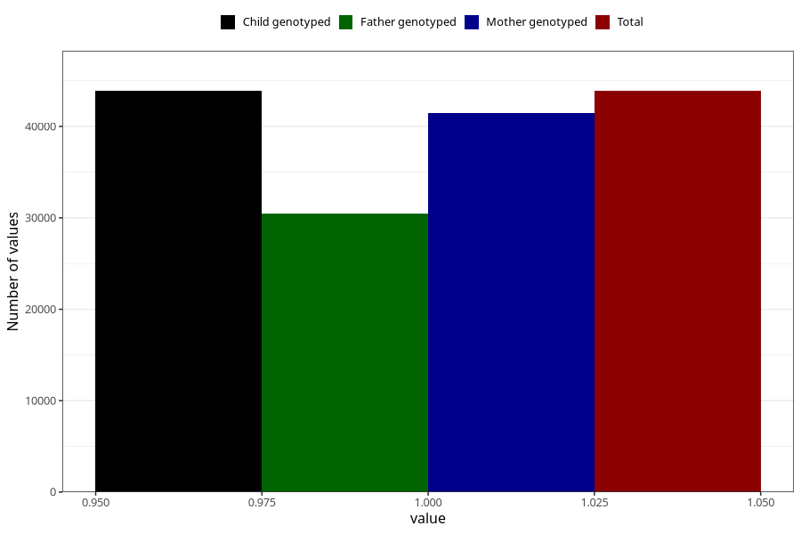

# diabetes_no_3y
Variable mapping to `GG49` in `Skjema6_3aar_v12`.
- Number of values:

| Value | Total | Child genotyped | Mother genotyped | Father genotyped |
| ----- | ----- | --------------- | ---------------- | ---------------- |
| Missing | 37121 | 37121 | 35107 | 23125 |
| Non-missing | 43884 | 43884 | 41510 | 30479 |
| 1 | 43884 | 43884 | 41510 | 30479 |

