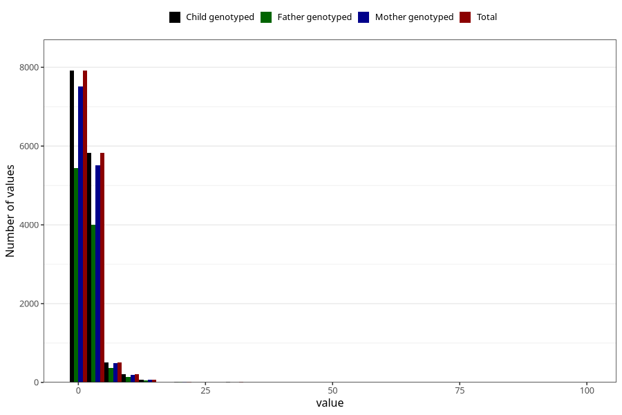

# ear_infection_freq_3y
Variable mapping to `GG138` in `Skjema6_3aar_v12`.
- Number of values:

| Value | Total | Child genotyped | Mother genotyped | Father genotyped |
| ----- | ----- | --------------- | ---------------- | ---------------- |
| Missing | 66447 | 66447 | 62825 | 43572 |
| Non-missing | 14558 | 14558 | 13792 | 10032 |
| 25th percentile | 1 | 1 | 1 | 1 |
| 50th percentile | 1 | 1 | 1 | 1 |
| 75th percentile | 2 | 2 | 2 | 2 |
| Mean | 2.13690067316939 | 2.13690067316939 | 2.13587587006961 | 2.12739234449761 |
| Standard deviation | 2.57201233244207 | 2.57201233244207 | 2.59991924122121 | 2.3206517279853 |
| N | 14558 | 14558 | 13792 | 10032 |

