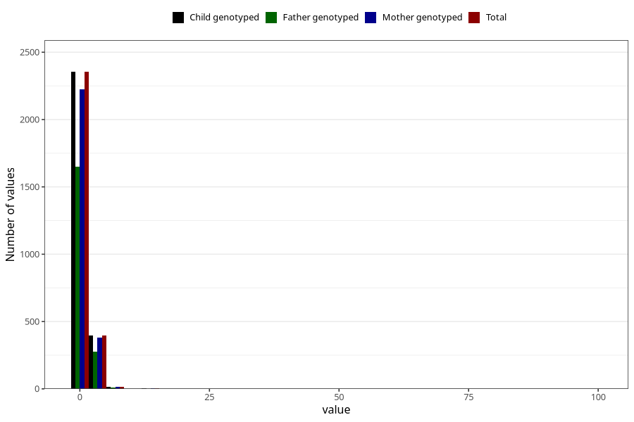

# ear_infection_freq_6m
Variable mapping to `DD272` in `Skjema4_6mnd_v12`.
- Number of values:

| Value | Total | Child genotyped | Mother genotyped | Father genotyped |
| ----- | ----- | --------------- | ---------------- | ---------------- |
| Missing | 78239 | 78239 | 73994 | 51668 |
| Non-missing | 2766 | 2766 | 2623 | 1936 |
| 0 | 94 | 94 | 90 | 72 |
| 1 | 2260 | 2260 | 2134 | 1577 |
| 2 | 300 | 300 | 290 | 204 |
| 3 | 69 | 69 | 68 | 53 |
| 4 | 17 | 17 | 15 | 10 |
| 5 | 9 | 9 | 9 | 8 |
| 6 | 5 | 5 | 5 | 5 |
| 7 | 8 | 8 | 8 | 5 |
| 10 | 1 | 1 | 1 | 1 |
| 12 | 1 | 1 | 1 | 0 |
| 15 | 1 | 1 | 1 | 0 |
| 99 | 1 | 1 | 1 | 1 |

