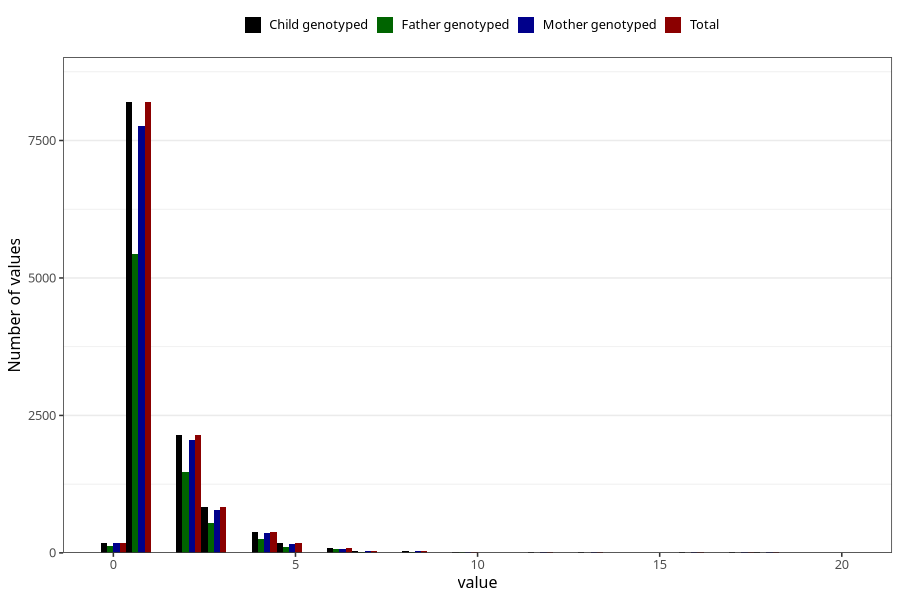

# ear_infection_number_12_18m
Variable mapping to `EE228` in `Skjema5_18mnd_v12`.
- Number of values:

| Value | Total | Child genotyped | Mother genotyped | Father genotyped |
| ----- | ----- | --------------- | ---------------- | ---------------- |
| Missing | 68902 | 68902 | 65126 | 45529 |
| Non-missing | 12103 | 12103 | 11491 | 8075 |
| 25th percentile | 1 | 1 | 1 | 1 |
| 50th percentile | 1 | 1 | 1 | 1 |
| 75th percentile | 2 | 2 | 2 | 2 |
| Mean | 1.58291332727423 | 1.58291332727423 | 1.58698111565573 | 1.57808049535604 |
| Standard deviation | 1.38649631949252 | 1.38649631949252 | 1.39674532707101 | 1.36662509039098 |
| N | 12103 | 12103 | 11491 | 8075 |

