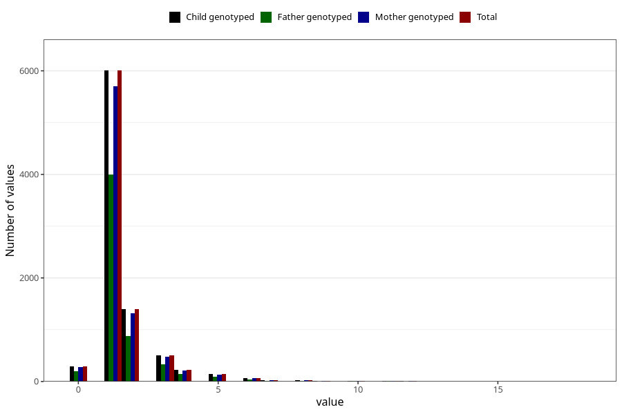

# ear_infection_number_6_11m
Variable mapping to `EE226` in `Skjema5_18mnd_v12`.
- Number of values:

| Value | Total | Child genotyped | Mother genotyped | Father genotyped |
| ----- | ----- | --------------- | ---------------- | ---------------- |
| Missing | 72294 | 72294 | 68351 | 47881 |
| Non-missing | 8711 | 8711 | 8266 | 5723 |
| 0 | 289 | 289 | 274 | 199 |
| 1 | 6006 | 6006 | 5696 | 3997 |
| 2 | 1396 | 1396 | 1318 | 883 |
| 3 | 504 | 504 | 484 | 330 |
| 4 | 228 | 228 | 218 | 144 |
| 5 | 139 | 139 | 134 | 87 |
| 6 | 67 | 67 | 61 | 38 |
| 7 | 29 | 29 | 28 | 17 |
| 8 | 19 | 19 | 19 | 8 |
| 9 | 6 | 6 | 6 | 4 |
| 10 | 15 | 15 | 15 | 7 |
| 11 | 6 | 6 | 6 | 5 |
| 12 | 5 | 5 | 5 | 3 |
| 15 | 1 | 1 | 1 | 1 |
| 18 | 1 | 1 | 1 | 0 |

