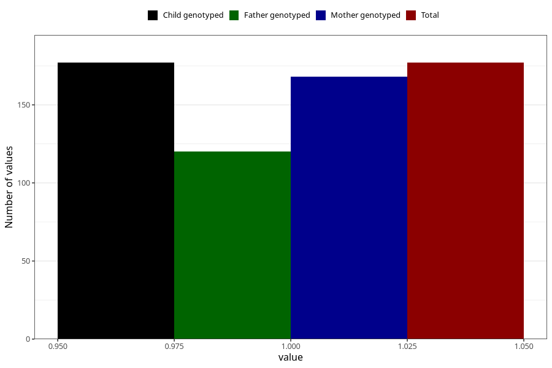

# epilepsy_7y
Variable mapping to `JJ434` in `Skjema7aar_v12`.
- Number of values:

| Value | Total | Child genotyped | Mother genotyped | Father genotyped |
| ----- | ----- | --------------- | ---------------- | ---------------- |
| Missing | 80828 | 80828 | 76449 | 53484 |
| Non-missing | 177 | 177 | 168 | 120 |
| 1 | 177 | 177 | 168 | 120 |

