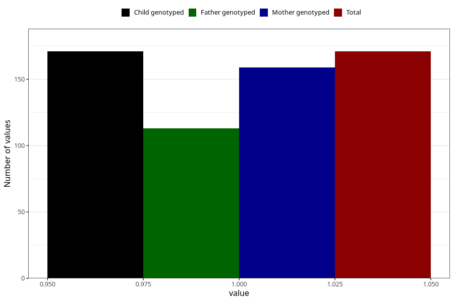

# epilepsy_8y
Variable mapping to `NN29` in `Skjema8aar_v12`.
- Number of values:

| Value | Total | Child genotyped | Mother genotyped | Father genotyped |
| ----- | ----- | --------------- | ---------------- | ---------------- |
| Missing | 80834 | 80834 | 76458 | 53491 |
| Non-missing | 171 | 171 | 159 | 113 |
| 1 | 171 | 171 | 159 | 113 |

