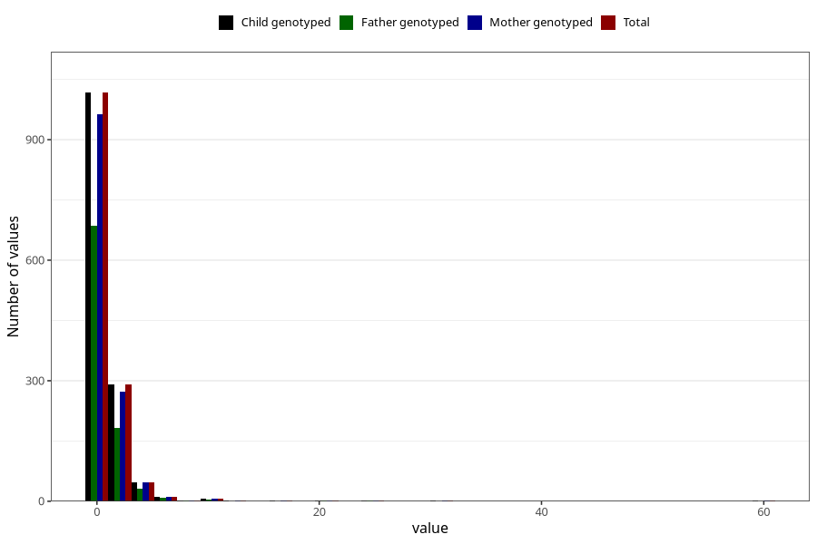

# febrile_convulsions_freq_3y
Variable mapping to `GG159` in `Skjema6_3aar_v12`.
- Number of values:

| Value | Total | Child genotyped | Mother genotyped | Father genotyped |
| ----- | ----- | --------------- | ---------------- | ---------------- |
| Missing | 79625 | 79625 | 75310 | 52684 |
| Non-missing | 1380 | 1380 | 1307 | 920 |
| 0 | 41 | 41 | 40 | 27 |
| 1 | 976 | 976 | 923 | 659 |
| 2 | 229 | 229 | 216 | 145 |
| 3 | 61 | 61 | 57 | 38 |
| 4 | 29 | 29 | 29 | 19 |
| 5 | 17 | 17 | 17 | 13 |
| 6 | 7 | 7 | 6 | 4 |
| 7 | 5 | 5 | 4 | 5 |
| 8 | 2 | 2 | 2 | 2 |
| 9 | 1 | 1 | 1 | 1 |
| 10 | 3 | 3 | 3 | 2 |
| 11 | 3 | 3 | 3 | 3 |
| 13 | 1 | 1 | 1 | 0 |
| 16 | 1 | 1 | 1 | 0 |
| 20 | 1 | 1 | 1 | 1 |
| 25 | 1 | 1 | 1 | 1 |
| 32 | 1 | 1 | 1 | 0 |
| 60 | 1 | 1 | 1 | 0 |

