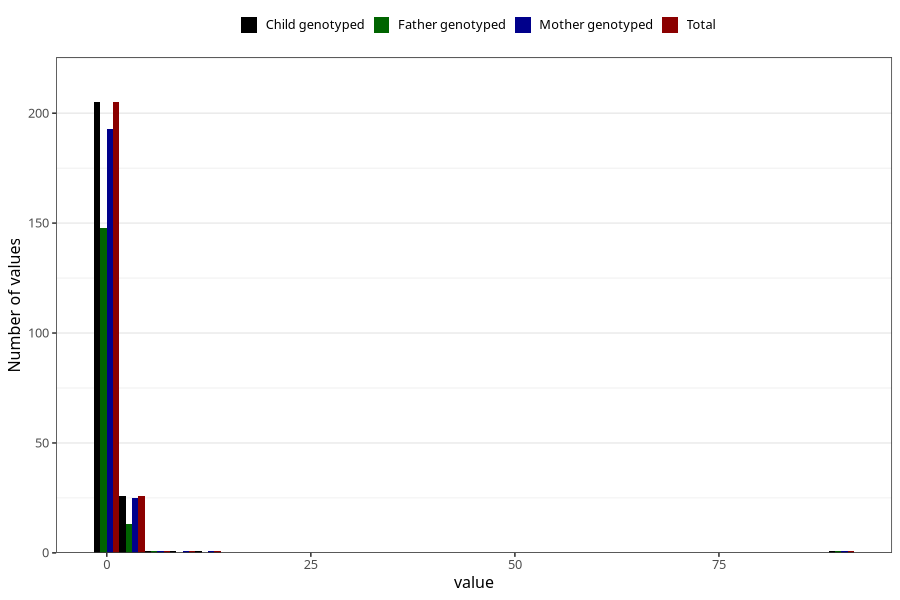

# febrile_convulsions_freq_6m
Variable mapping to `DD296` in `Skjema4_6mnd_v12`.
- Number of values:

| Value | Total | Child genotyped | Mother genotyped | Father genotyped |
| ----- | ----- | --------------- | ---------------- | ---------------- |
| Missing | 80770 | 80770 | 76395 | 53441 |
| Non-missing | 235 | 235 | 222 | 163 |
| 0 | 92 | 92 | 88 | 68 |
| 1 | 113 | 113 | 105 | 80 |
| 2 | 21 | 21 | 20 | 11 |
| 3 | 3 | 3 | 3 | 1 |
| 4 | 2 | 2 | 2 | 1 |
| 5 | 1 | 1 | 1 | 1 |
| 8 | 1 | 1 | 1 | 0 |
| 11 | 1 | 1 | 1 | 0 |
| 90 | 1 | 1 | 1 | 1 |

