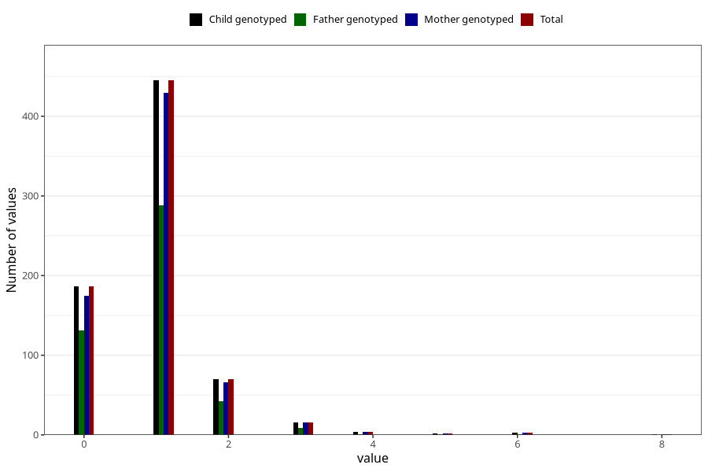

# febrile_convulsions_number_6_11m
Variable mapping to `EE256` in `Skjema5_18mnd_v12`.
- Number of values:

| Value | Total | Child genotyped | Mother genotyped | Father genotyped |
| ----- | ----- | --------------- | ---------------- | ---------------- |
| Missing | 80278 | 80278 | 75921 | 53131 |
| Non-missing | 727 | 727 | 696 | 473 |
| 0 | 186 | 186 | 175 | 131 |
| 1 | 445 | 445 | 429 | 288 |
| 2 | 70 | 70 | 66 | 42 |
| 3 | 16 | 16 | 16 | 9 |
| 4 | 4 | 4 | 4 | 1 |
| 5 | 2 | 2 | 2 | 1 |
| 6 | 3 | 3 | 3 | 1 |
| 8 | 1 | 1 | 1 | 0 |

