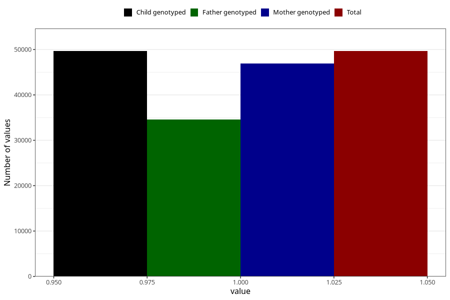

# food_allergy_intolerance_no_18m
Variable mapping to `EE835` in `Skjema5_18mnd_v12`.
- Number of values:

| Value | Total | Child genotyped | Mother genotyped | Father genotyped |
| ----- | ----- | --------------- | ---------------- | ---------------- |
| Missing | 31354 | 31354 | 29652 | 18982 |
| Non-missing | 49651 | 49651 | 46965 | 34622 |
| 1 | 49651 | 49651 | 46965 | 34622 |

