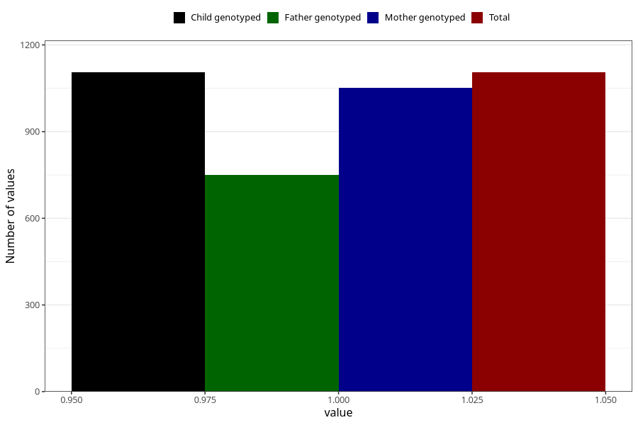

# food_allergy_intolerance_previously_18m
Variable mapping to `EE837` in `Skjema5_18mnd_v12`.
- Number of values:

| Value | Total | Child genotyped | Mother genotyped | Father genotyped |
| ----- | ----- | --------------- | ---------------- | ---------------- |
| Missing | 79900 | 79900 | 75566 | 52854 |
| Non-missing | 1105 | 1105 | 1051 | 750 |
| 1 | 1105 | 1105 | 1051 | 750 |

