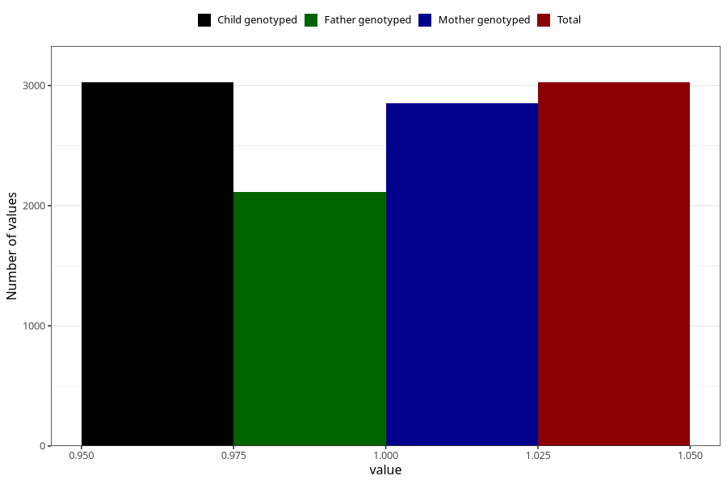

# food_allergy_intolerance_yes_18m
Variable mapping to `EE836` in `Skjema5_18mnd_v12`.
- Number of values:

| Value | Total | Child genotyped | Mother genotyped | Father genotyped |
| ----- | ----- | --------------- | ---------------- | ---------------- |
| Missing | 77979 | 77979 | 73764 | 51493 |
| Non-missing | 3026 | 3026 | 2853 | 2111 |
| 1 | 3026 | 3026 | 2853 | 2111 |

