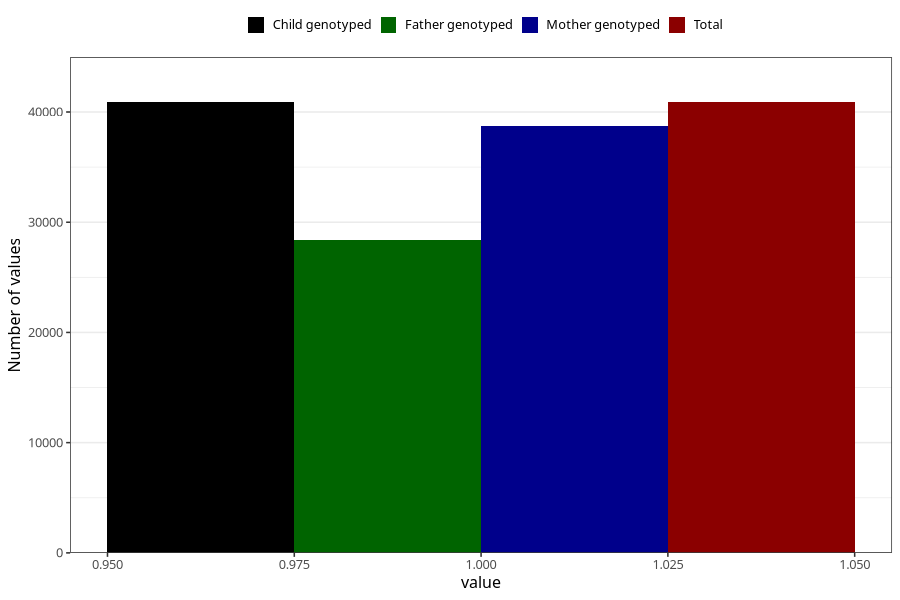

# food_allergy_no_3y
Variable mapping to `GG85` in `Skjema6_3aar_v12`.
- Number of values:

| Value | Total | Child genotyped | Mother genotyped | Father genotyped |
| ----- | ----- | --------------- | ---------------- | ---------------- |
| Missing | 40116 | 40116 | 37920 | 25197 |
| Non-missing | 40889 | 40889 | 38697 | 28407 |
| 1 | 40889 | 40889 | 38697 | 28407 |

