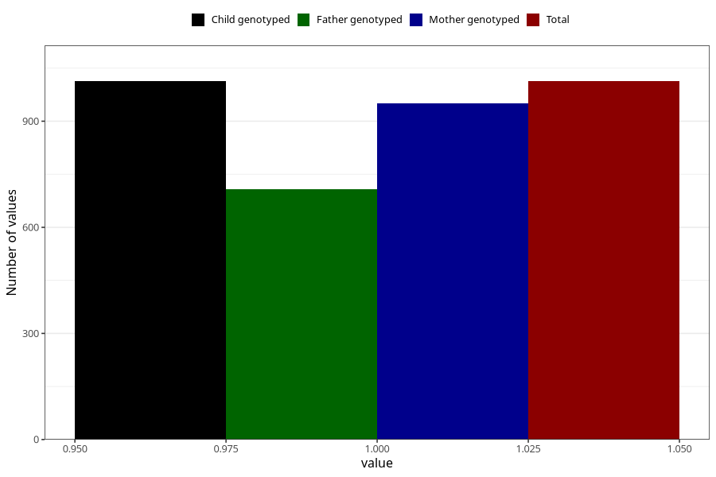

# food_allergy_previous_3y
Variable mapping to `GG87` in `Skjema6_3aar_v12`.
- Number of values:

| Value | Total | Child genotyped | Mother genotyped | Father genotyped |
| ----- | ----- | --------------- | ---------------- | ---------------- |
| Missing | 79992 | 79992 | 75667 | 52897 |
| Non-missing | 1013 | 1013 | 950 | 707 |
| 1 | 1013 | 1013 | 950 | 707 |

