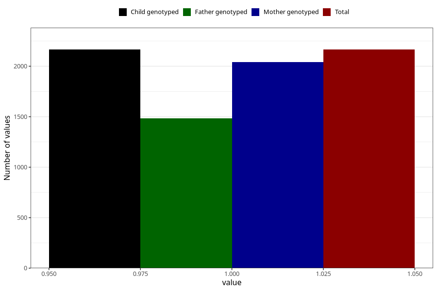

# food_allergy_yes_3y
Variable mapping to `GG86` in `Skjema6_3aar_v12`.
- Number of values:

| Value | Total | Child genotyped | Mother genotyped | Father genotyped |
| ----- | ----- | --------------- | ---------------- | ---------------- |
| Missing | 78840 | 78840 | 74578 | 52121 |
| Non-missing | 2165 | 2165 | 2039 | 1483 |
| 1 | 2165 | 2165 | 2039 | 1483 |

