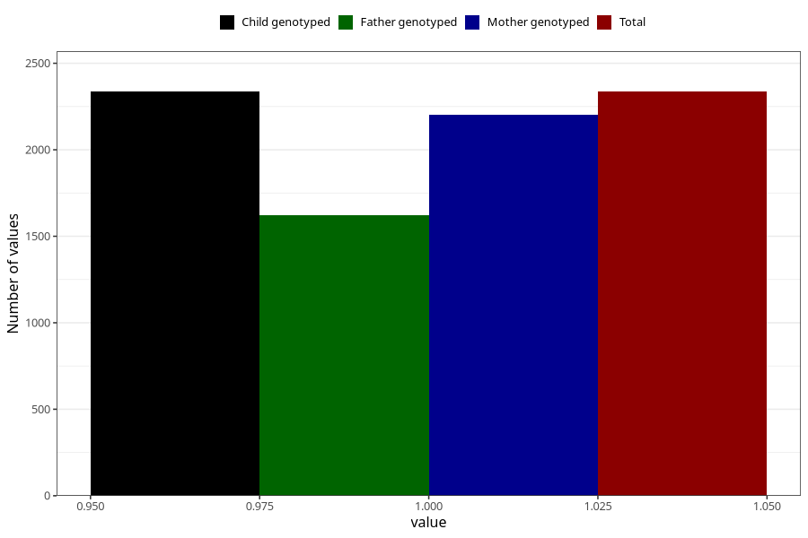

# fracture_injuries_7y
Variable mapping to `JJ433` in `Skjema7aar_v12`.
- Number of values:

| Value | Total | Child genotyped | Mother genotyped | Father genotyped |
| ----- | ----- | --------------- | ---------------- | ---------------- |
| Missing | 78669 | 78669 | 74413 | 51984 |
| Non-missing | 2336 | 2336 | 2204 | 1620 |
| 1 | 2336 | 2336 | 2204 | 1620 |

