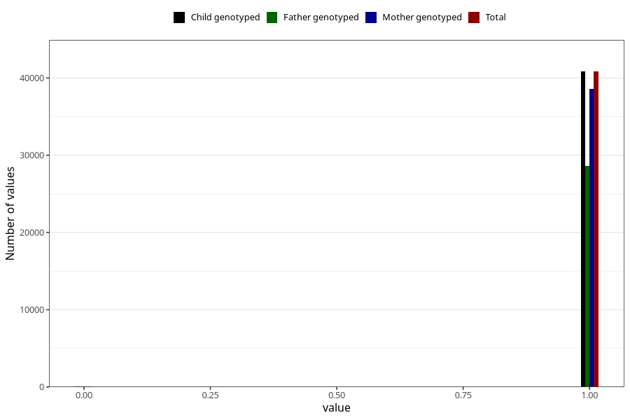

# frequent_stomach_pain_no_3y
Variable mapping to `GG570` in `Skjema6_3aar_v12`.
- Number of values:

| Value | Total | Child genotyped | Mother genotyped | Father genotyped |
| ----- | ----- | --------------- | ---------------- | ---------------- |
| Missing | 40056 | 40056 | 37903 | 24873 |
| Non-missing | 40949 | 40949 | 38714 | 28731 |
| 0 | 109 | 109 | 103 | 73 |
| 1 | 40840 | 40840 | 38611 | 28658 |

