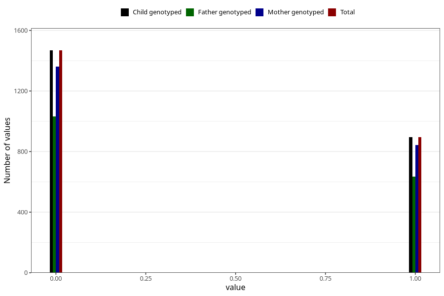

# frequent_stomach_pain_previous_3y
Variable mapping to `GG572` in `Skjema6_3aar_v12`.
- Number of values:

| Value | Total | Child genotyped | Mother genotyped | Father genotyped |
| ----- | ----- | --------------- | ---------------- | ---------------- |
| Missing | 78641 | 78641 | 74412 | 51938 |
| Non-missing | 2364 | 2364 | 2205 | 1666 |
| 0 | 1468 | 1468 | 1362 | 1032 |
| 1 | 896 | 896 | 843 | 634 |

