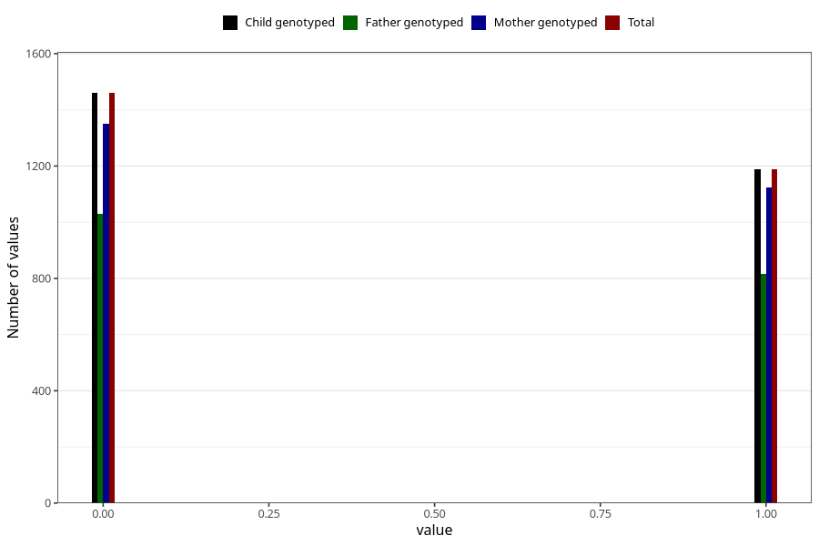

# frequent_stomach_pain_yes_3y
Variable mapping to `GG571` in `Skjema6_3aar_v12`.
- Number of values:

| Value | Total | Child genotyped | Mother genotyped | Father genotyped |
| ----- | ----- | --------------- | ---------------- | ---------------- |
| Missing | 78357 | 78357 | 74142 | 51757 |
| Non-missing | 2648 | 2648 | 2475 | 1847 |
| 0 | 1460 | 1460 | 1351 | 1030 |
| 1 | 1188 | 1188 | 1124 | 817 |

