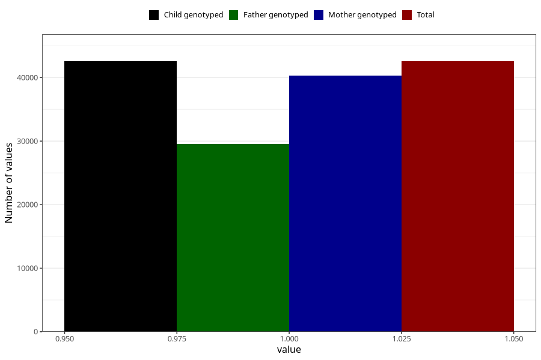

# gained_too_little_weight_no_3y
Variable mapping to `GG53` in `Skjema6_3aar_v12`.
- Number of values:

| Value | Total | Child genotyped | Mother genotyped | Father genotyped |
| ----- | ----- | --------------- | ---------------- | ---------------- |
| Missing | 38447 | 38447 | 36350 | 24018 |
| Non-missing | 42558 | 42558 | 40267 | 29586 |
| 1 | 42558 | 42558 | 40267 | 29586 |

