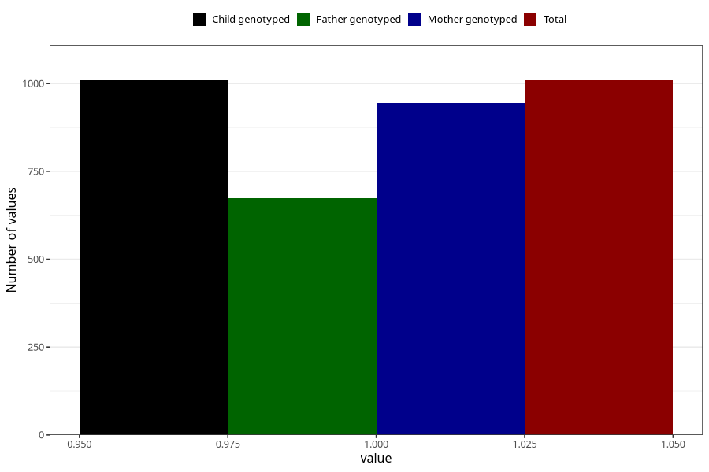

# gained_too_little_weight_previous_3y
Variable mapping to `GG55` in `Skjema6_3aar_v12`.
- Number of values:

| Value | Total | Child genotyped | Mother genotyped | Father genotyped |
| ----- | ----- | --------------- | ---------------- | ---------------- |
| Missing | 79996 | 79996 | 75673 | 52930 |
| Non-missing | 1009 | 1009 | 944 | 674 |
| 1 | 1009 | 1009 | 944 | 674 |

