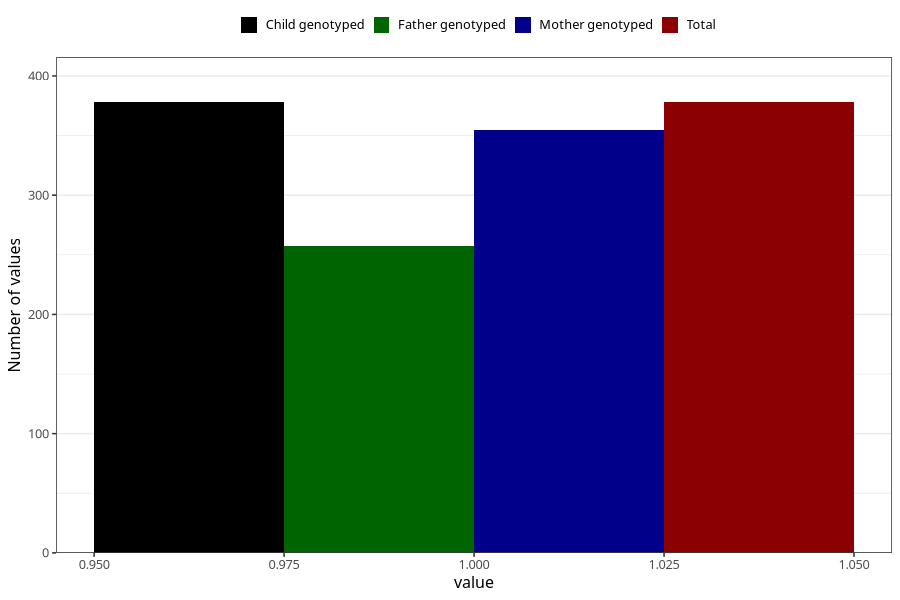

# gained_too_little_weight_yes_3y
Variable mapping to `GG54` in `Skjema6_3aar_v12`.
- Number of values:

| Value | Total | Child genotyped | Mother genotyped | Father genotyped |
| ----- | ----- | --------------- | ---------------- | ---------------- |
| Missing | 80627 | 80627 | 76262 | 53347 |
| Non-missing | 378 | 378 | 355 | 257 |
| 1 | 378 | 378 | 355 | 257 |

