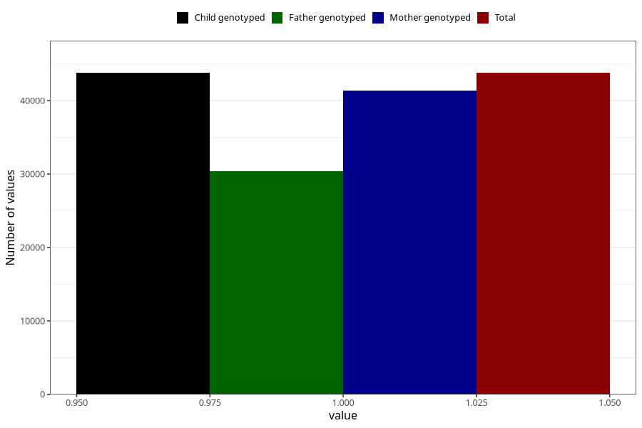

# gained_too_much_weight_no_3y
Variable mapping to `GG57` in `Skjema6_3aar_v12`.
- Number of values:

| Value | Total | Child genotyped | Mother genotyped | Father genotyped |
| ----- | ----- | --------------- | ---------------- | ---------------- |
| Missing | 37234 | 37234 | 35215 | 23196 |
| Non-missing | 43771 | 43771 | 41402 | 30408 |
| 1 | 43771 | 43771 | 41402 | 30408 |

