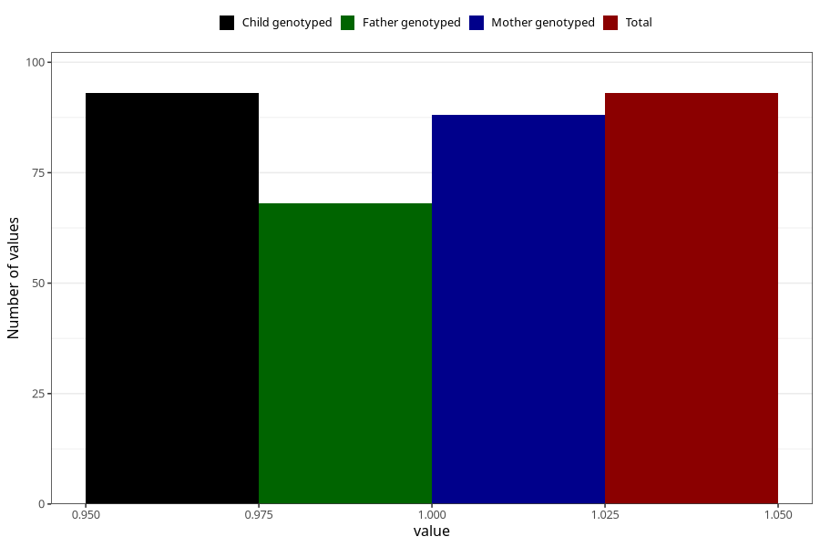

# gained_too_much_weight_previous_3y
Variable mapping to `GG59` in `Skjema6_3aar_v12`.
- Number of values:

| Value | Total | Child genotyped | Mother genotyped | Father genotyped |
| ----- | ----- | --------------- | ---------------- | ---------------- |
| Missing | 80912 | 80912 | 76529 | 53536 |
| Non-missing | 93 | 93 | 88 | 68 |
| 1 | 93 | 93 | 88 | 68 |

