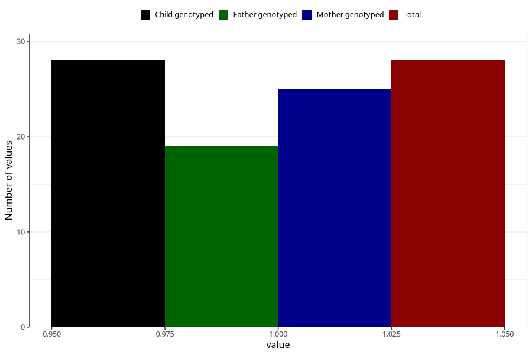

# gained_too_much_weight_yes_3y
Variable mapping to `GG58` in `Skjema6_3aar_v12`.
- Number of values:

| Value | Total | Child genotyped | Mother genotyped | Father genotyped |
| ----- | ----- | --------------- | ---------------- | ---------------- |
| Missing | 80977 | 80977 | 76592 | 53585 |
| Non-missing | 28 | 28 | 25 | 19 |
| 1 | 28 | 28 | 25 | 19 |

