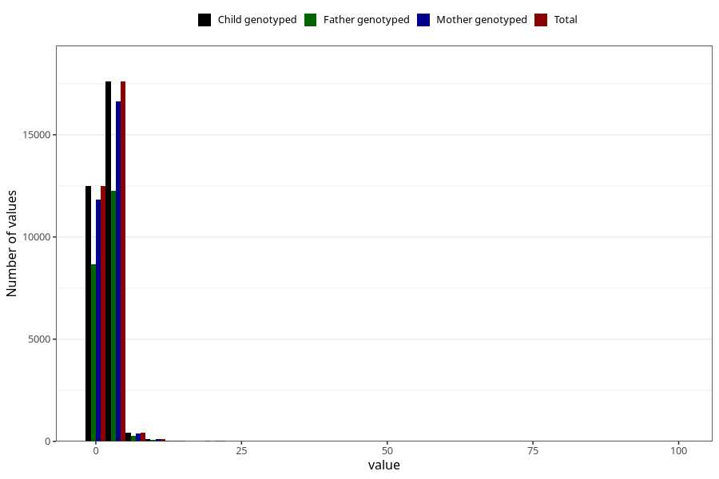

# gastric_flu_diarrhea_freq_3y
Variable mapping to `GG150` in `Skjema6_3aar_v12`.
- Number of values:

| Value | Total | Child genotyped | Mother genotyped | Father genotyped |
| ----- | ----- | --------------- | ---------------- | ---------------- |
| Missing | 50310 | 50310 | 47590 | 32268 |
| Non-missing | 30695 | 30695 | 29027 | 21336 |
| 25th percentile | 1 | 1 | 1 | 1 |
| 50th percentile | 2 | 2 | 2 | 2 |
| 75th percentile | 2 | 2 | 2 | 2 |
| Mean | 2.04968235869034 | 2.04968235869034 | 2.04392462190374 | 2.04649418822647 |
| Standard deviation | 1.95138038267665 | 1.95138038267665 | 1.94424627425894 | 1.74674866556292 |
| N | 30695 | 30695 | 29027 | 21336 |

