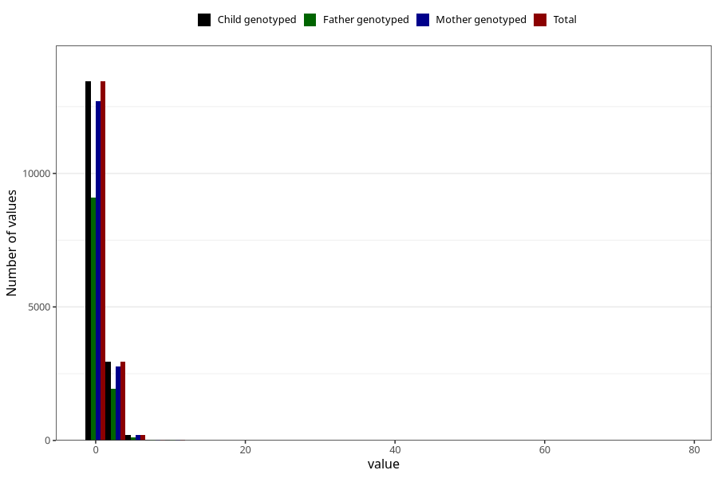

# gastric_flu_diarrhea_number_6_11m
Variable mapping to `EE241` in `Skjema5_18mnd_v12`.
- Number of values:

| Value | Total | Child genotyped | Mother genotyped | Father genotyped |
| ----- | ----- | --------------- | ---------------- | ---------------- |
| Missing | 64310 | 64310 | 60859 | 42396 |
| Non-missing | 16695 | 16695 | 15758 | 11208 |
| 25th percentile | 1 | 1 | 1 | 1 |
| 50th percentile | 1 | 1 | 1 | 1 |
| 75th percentile | 1 | 1 | 1 | 1 |
| Mean | 1.28757112908056 | 1.28757112908056 | 1.28537885518467 | 1.26650606709493 |
| Standard deviation | 1.20485746164943 | 1.20485746164943 | 1.20673921779935 | 1.1688434077725 |
| N | 16695 | 16695 | 15758 | 11208 |

