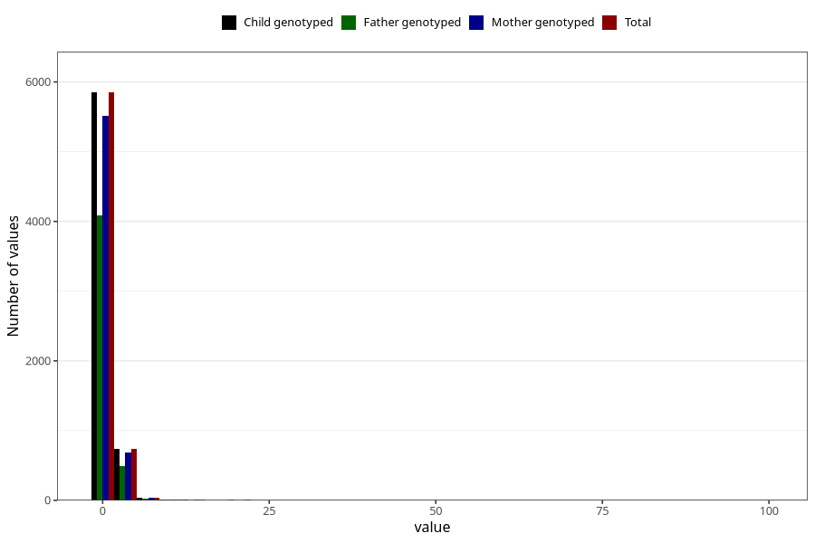

# gastric_flu_diarrhoea_freq_6m
Variable mapping to `DD284` in `Skjema4_6mnd_v12`.
- Number of values:

| Value | Total | Child genotyped | Mother genotyped | Father genotyped |
| ----- | ----- | --------------- | ---------------- | ---------------- |
| Missing | 74351 | 74351 | 70350 | 48991 |
| Non-missing | 6654 | 6654 | 6267 | 4613 |
| 25th percentile | 1 | 1 | 1 | 1 |
| 50th percentile | 1 | 1 | 1 | 1 |
| 75th percentile | 1 | 1 | 1 | 1 |
| Mean | 1.24481514878269 | 1.24481514878269 | 1.24493378011808 | 1.23737264253197 |
| Standard deviation | 1.79106270826179 | 1.79106270826179 | 1.82304583418857 | 1.96561271321203 |
| N | 6654 | 6654 | 6267 | 4613 |

