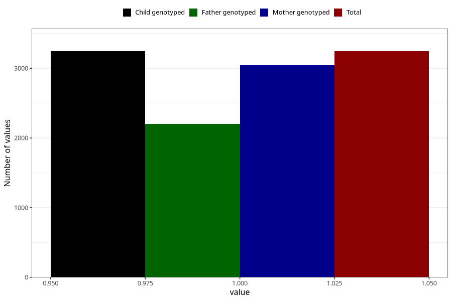

# had_an_ear_drain_7y
Variable mapping to `JJ440` in `Skjema7aar_v12`.
- Number of values:

| Value | Total | Child genotyped | Mother genotyped | Father genotyped |
| ----- | ----- | --------------- | ---------------- | ---------------- |
| Missing | 77760 | 77760 | 73570 | 51400 |
| Non-missing | 3245 | 3245 | 3047 | 2204 |
| 1 | 3245 | 3245 | 3047 | 2204 |

