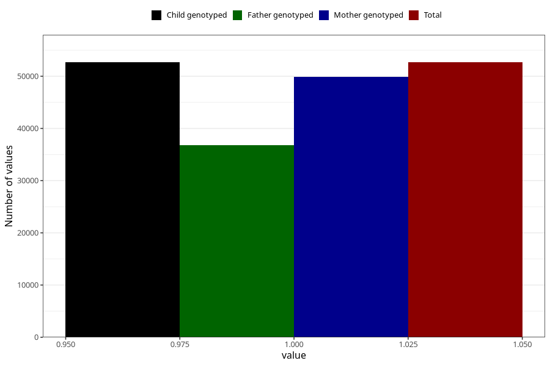

# heart_defect_no_18m
Variable mapping to `EE815` in `Skjema5_18mnd_v12`.
- Number of values:

| Value | Total | Child genotyped | Mother genotyped | Father genotyped |
| ----- | ----- | --------------- | ---------------- | ---------------- |
| Missing | 28346 | 28346 | 26794 | 16867 |
| Non-missing | 52659 | 52659 | 49823 | 36737 |
| 1 | 52659 | 52659 | 49823 | 36737 |

