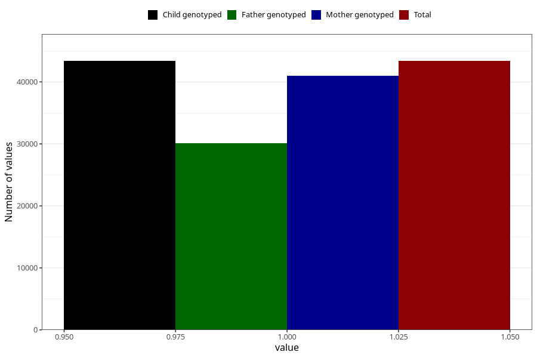

# heart_defect_no_3y
Variable mapping to `GG61` in `Skjema6_3aar_v12`.
- Number of values:

| Value | Total | Child genotyped | Mother genotyped | Father genotyped |
| ----- | ----- | --------------- | ---------------- | ---------------- |
| Missing | 37626 | 37626 | 35588 | 23480 |
| Non-missing | 43379 | 43379 | 41029 | 30124 |
| 1 | 43379 | 43379 | 41029 | 30124 |

