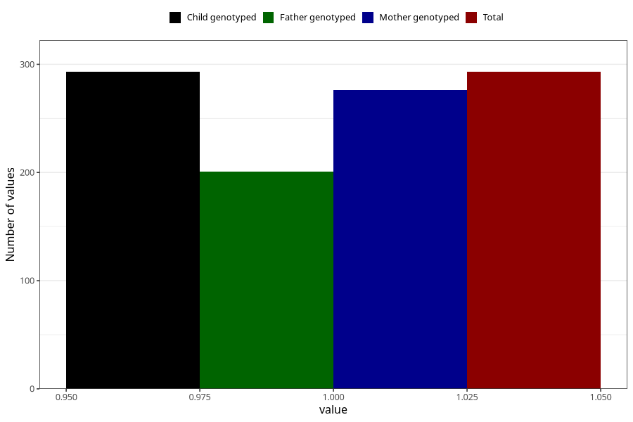

# heart_defect_previous_3y
Variable mapping to `GG63` in `Skjema6_3aar_v12`.
- Number of values:

| Value | Total | Child genotyped | Mother genotyped | Father genotyped |
| ----- | ----- | --------------- | ---------------- | ---------------- |
| Missing | 80712 | 80712 | 76341 | 53403 |
| Non-missing | 293 | 293 | 276 | 201 |
| 1 | 293 | 293 | 276 | 201 |

