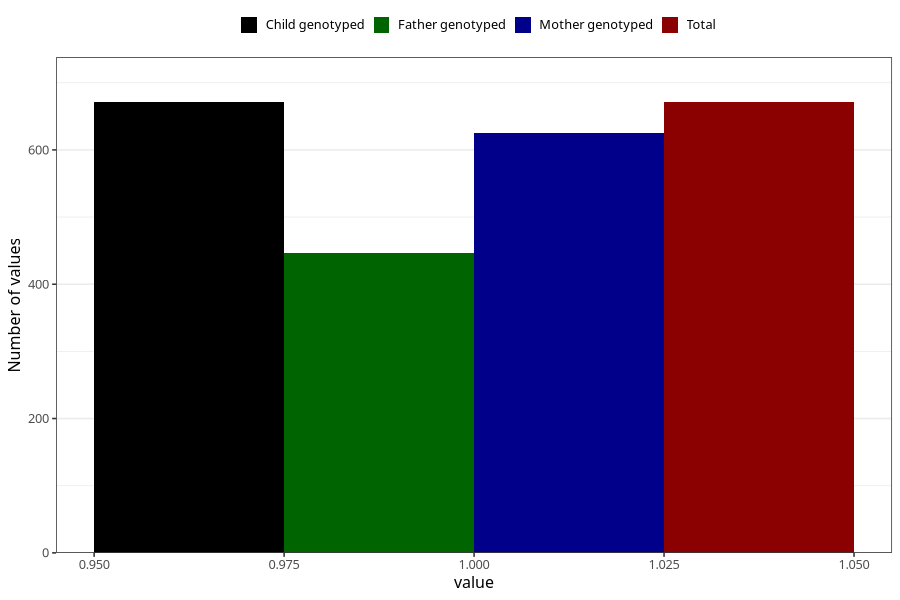

# heart_defect_previously_18m
Variable mapping to `EE817` in `Skjema5_18mnd_v12`.
- Number of values:

| Value | Total | Child genotyped | Mother genotyped | Father genotyped |
| ----- | ----- | --------------- | ---------------- | ---------------- |
| Missing | 80334 | 80334 | 75992 | 53158 |
| Non-missing | 671 | 671 | 625 | 446 |
| 1 | 671 | 671 | 625 | 446 |

