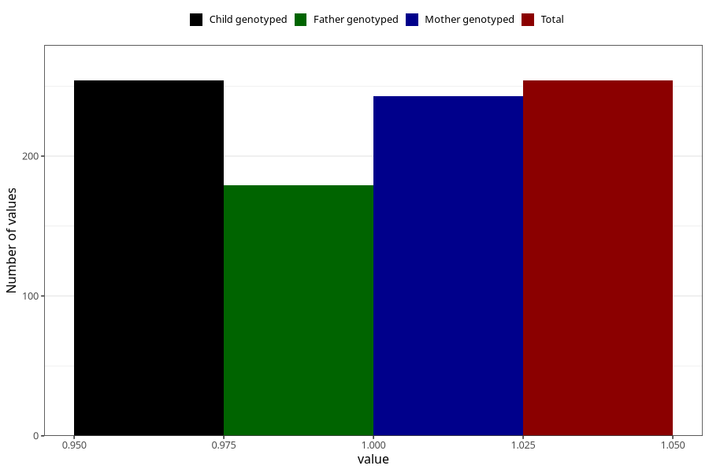

# heart_defect_yes_3y
Variable mapping to `GG62` in `Skjema6_3aar_v12`.
- Number of values:

| Value | Total | Child genotyped | Mother genotyped | Father genotyped |
| ----- | ----- | --------------- | ---------------- | ---------------- |
| Missing | 80751 | 80751 | 76374 | 53425 |
| Non-missing | 254 | 254 | 243 | 179 |
| 1 | 254 | 254 | 243 | 179 |

