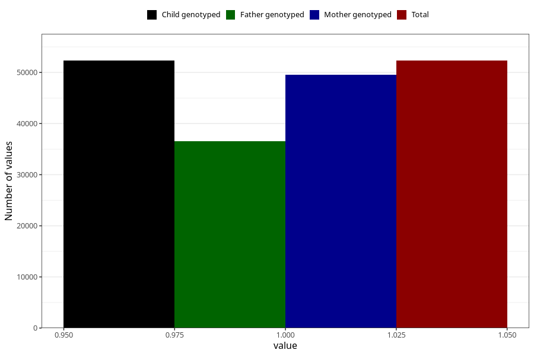

# hip_disorder_dislocated_hip_no_18m
Variable mapping to `EE787` in `Skjema5_18mnd_v12`.
- Number of values:

| Value | Total | Child genotyped | Mother genotyped | Father genotyped |
| ----- | ----- | --------------- | ---------------- | ---------------- |
| Missing | 28698 | 28698 | 27117 | 17107 |
| Non-missing | 52307 | 52307 | 49500 | 36497 |
| 1 | 52307 | 52307 | 49500 | 36497 |

