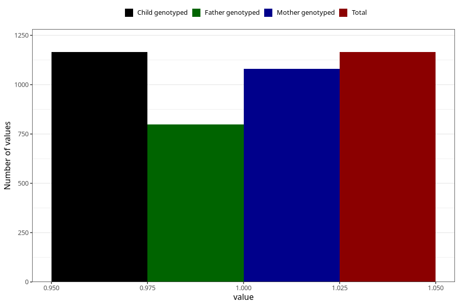

# hip_disorder_dislocated_hip_previously_18m
Variable mapping to `EE789` in `Skjema5_18mnd_v12`.
- Number of values:

| Value | Total | Child genotyped | Mother genotyped | Father genotyped |
| ----- | ----- | --------------- | ---------------- | ---------------- |
| Missing | 79840 | 79840 | 75537 | 52805 |
| Non-missing | 1165 | 1165 | 1080 | 799 |
| 1 | 1165 | 1165 | 1080 | 799 |

