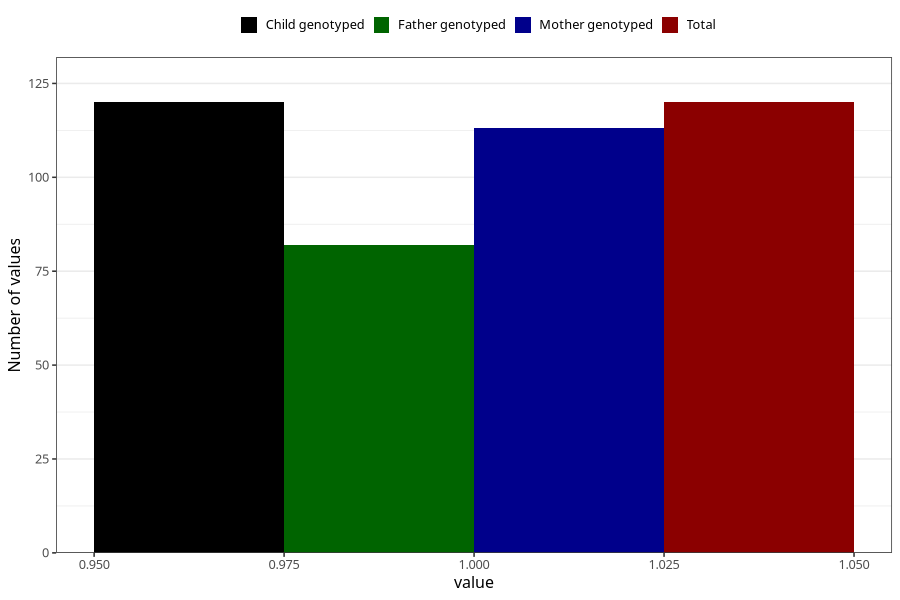

# hip_disorder_dislocated_hip_yes_18m
Variable mapping to `EE788` in `Skjema5_18mnd_v12`.
- Number of values:

| Value | Total | Child genotyped | Mother genotyped | Father genotyped |
| ----- | ----- | --------------- | ---------------- | ---------------- |
| Missing | 80885 | 80885 | 76504 | 53522 |
| Non-missing | 120 | 120 | 113 | 82 |
| 1 | 120 | 120 | 113 | 82 |

