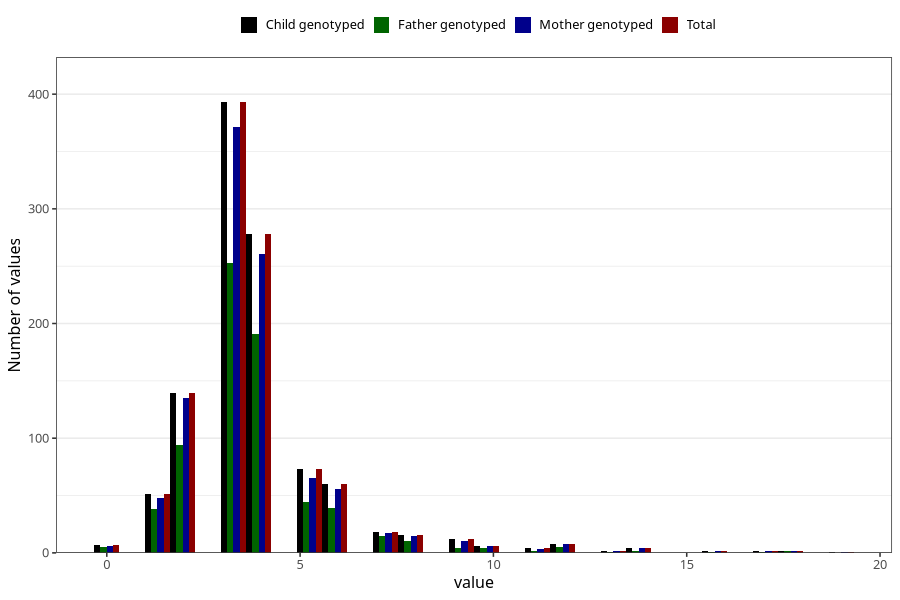

# hip_treated_cushion_duration_18m
Variable mapping to `EE214` in `Skjema5_18mnd_v12`.
- Number of values:

| Value | Total | Child genotyped | Mother genotyped | Father genotyped |
| ----- | ----- | --------------- | ---------------- | ---------------- |
| Missing | 79927 | 79927 | 75603 | 52893 |
| Non-missing | 1078 | 1078 | 1014 | 711 |
| 0 | 7 | 7 | 6 | 5 |
| 1 | 51 | 51 | 48 | 38 |
| 2 | 139 | 139 | 135 | 94 |
| 3 | 393 | 393 | 371 | 253 |
| 4 | 278 | 278 | 261 | 191 |
| 5 | 73 | 73 | 65 | 44 |
| 6 | 60 | 60 | 56 | 39 |
| 7 | 18 | 18 | 17 | 15 |
| 8 | 16 | 16 | 15 | 10 |
| 9 | 12 | 12 | 10 | 4 |
| 10 | 6 | 6 | 6 | 4 |
| 11 | 4 | 4 | 3 | 2 |
| 12 | 8 | 8 | 8 | 5 |
| 13 | 2 | 2 | 2 | 1 |
| 14 | 4 | 4 | 4 | 2 |
| 16 | 2 | 2 | 2 | 1 |
| 17 | 2 | 2 | 2 | 1 |
| 18 | 2 | 2 | 2 | 2 |
| 19 | 1 | 1 | 1 | 0 |

