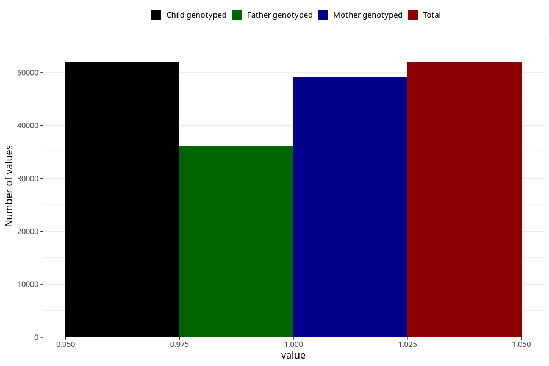

# hives_no_18m
Variable mapping to `EE831` in `Skjema5_18mnd_v12`.
- Number of values:

| Value | Total | Child genotyped | Mother genotyped | Father genotyped |
| ----- | ----- | --------------- | ---------------- | ---------------- |
| Missing | 29080 | 29080 | 27504 | 17389 |
| Non-missing | 51925 | 51925 | 49113 | 36215 |
| 1 | 51925 | 51925 | 49113 | 36215 |

