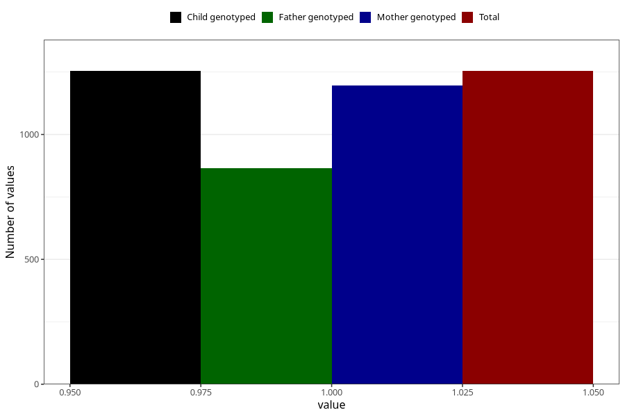

# hives_previously_18m
Variable mapping to `EE833` in `Skjema5_18mnd_v12`.
- Number of values:

| Value | Total | Child genotyped | Mother genotyped | Father genotyped |
| ----- | ----- | --------------- | ---------------- | ---------------- |
| Missing | 79751 | 79751 | 75421 | 52740 |
| Non-missing | 1254 | 1254 | 1196 | 864 |
| 1 | 1254 | 1254 | 1196 | 864 |

