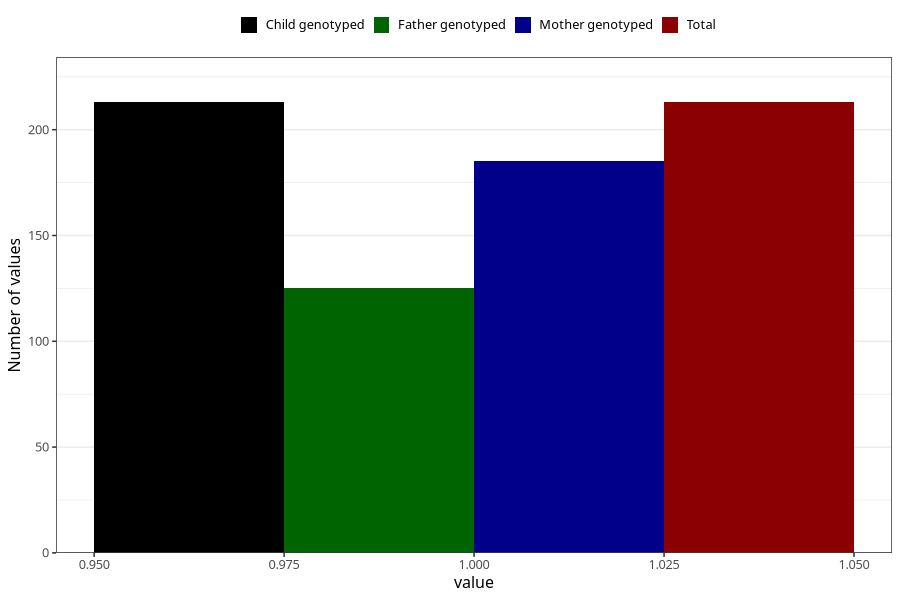

# hyperactivity_ADHD_7y
Variable mapping to `JJ431` in `Skjema7aar_v12`.
- Number of values:

| Value | Total | Child genotyped | Mother genotyped | Father genotyped |
| ----- | ----- | --------------- | ---------------- | ---------------- |
| Missing | 80792 | 80792 | 76432 | 53479 |
| Non-missing | 213 | 213 | 185 | 125 |
| 1 | 213 | 213 | 185 | 125 |

