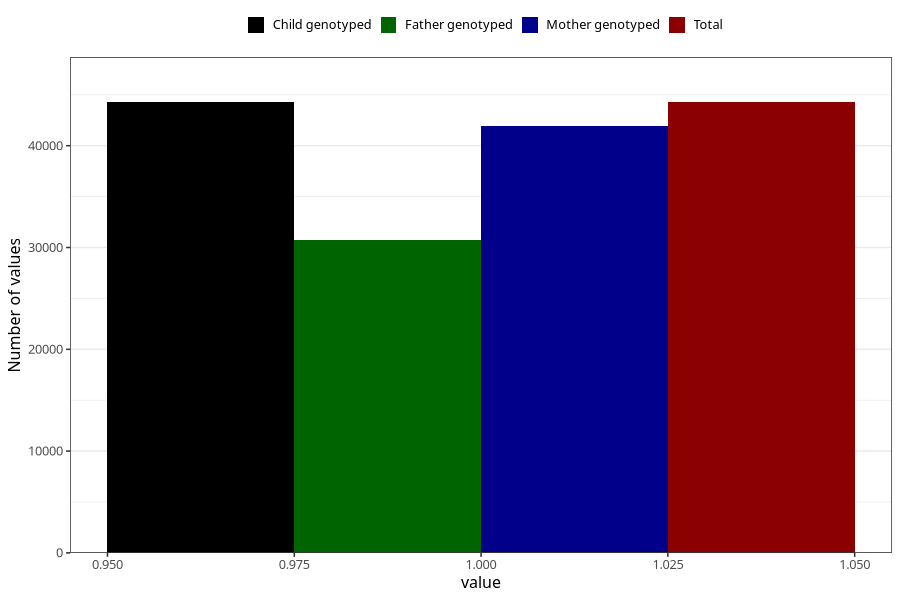

# hyperactivity_no_3y
Variable mapping to `GG105` in `Skjema6_3aar_v12`.
- Number of values:

| Value | Total | Child genotyped | Mother genotyped | Father genotyped |
| ----- | ----- | --------------- | ---------------- | ---------------- |
| Missing | 36733 | 36733 | 34727 | 22853 |
| Non-missing | 44272 | 44272 | 41890 | 30751 |
| 1 | 44272 | 44272 | 41890 | 30751 |

