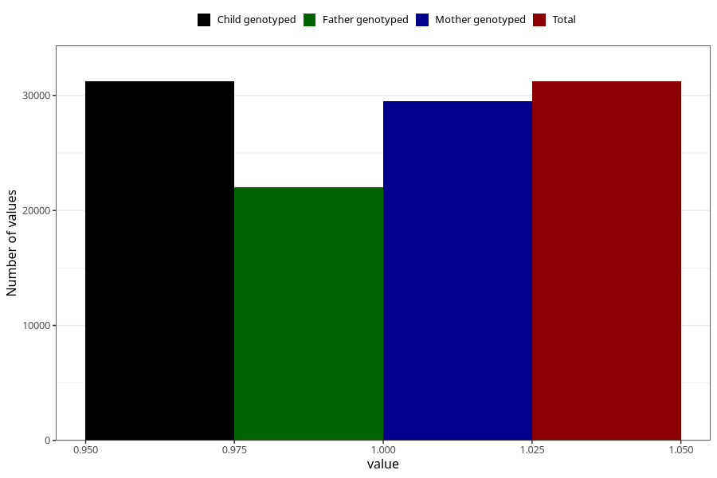

# hyperactivity_no_8y
Variable mapping to `NN44` in `Skjema8aar_v12`.
- Number of values:

| Value | Total | Child genotyped | Mother genotyped | Father genotyped |
| ----- | ----- | --------------- | ---------------- | ---------------- |
| Missing | 49783 | 49783 | 47114 | 31577 |
| Non-missing | 31222 | 31222 | 29503 | 22027 |
| 1 | 31222 | 31222 | 29503 | 22027 |

