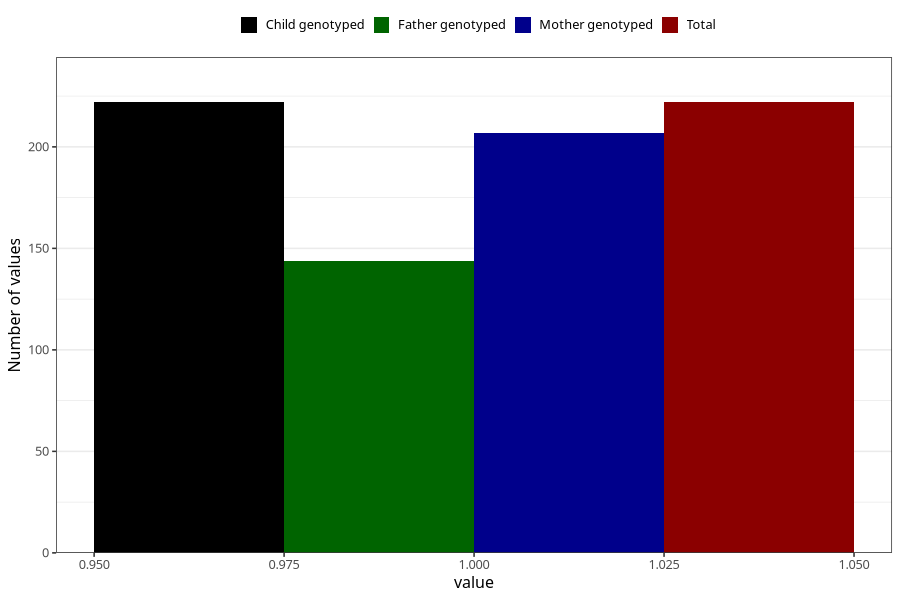

# hyperactivity_past_8y
Variable mapping to `NN46` in `Skjema8aar_v12`.
- Number of values:

| Value | Total | Child genotyped | Mother genotyped | Father genotyped |
| ----- | ----- | --------------- | ---------------- | ---------------- |
| Missing | 80783 | 80783 | 76410 | 53460 |
| Non-missing | 222 | 222 | 207 | 144 |
| 1 | 222 | 222 | 207 | 144 |

