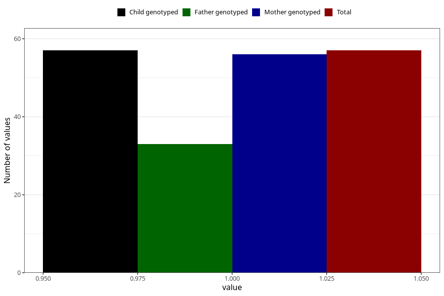

# hyperactivity_previous_3y
Variable mapping to `GG107` in `Skjema6_3aar_v12`.
- Number of values:

| Value | Total | Child genotyped | Mother genotyped | Father genotyped |
| ----- | ----- | --------------- | ---------------- | ---------------- |
| Missing | 80948 | 80948 | 76561 | 53571 |
| Non-missing | 57 | 57 | 56 | 33 |
| 1 | 57 | 57 | 56 | 33 |

