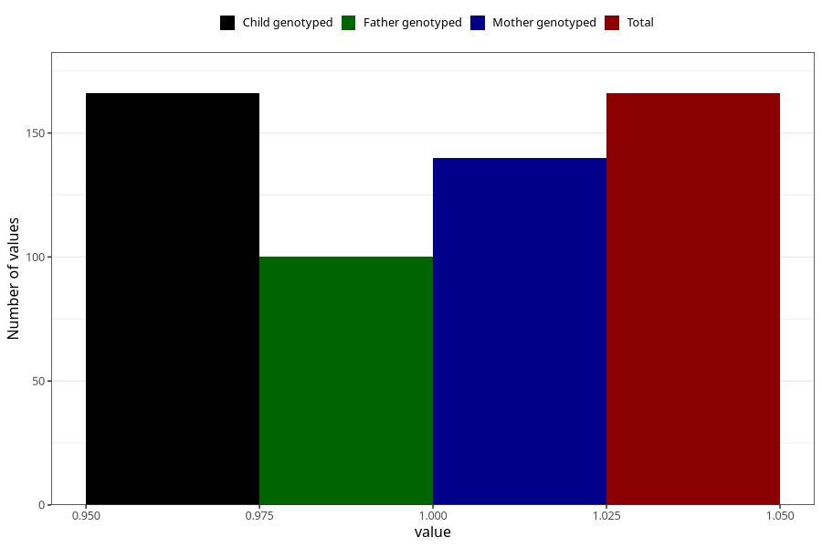

# hyperactivity_yes_3y
Variable mapping to `GG106` in `Skjema6_3aar_v12`.
- Number of values:

| Value | Total | Child genotyped | Mother genotyped | Father genotyped |
| ----- | ----- | --------------- | ---------------- | ---------------- |
| Missing | 80839 | 80839 | 76477 | 53504 |
| Non-missing | 166 | 166 | 140 | 100 |
| 1 | 166 | 166 | 140 | 100 |

