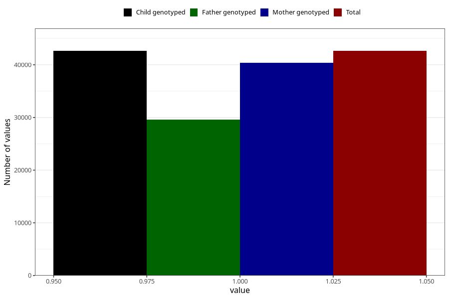

# impaired_hearing_no_3y
Variable mapping to `GG29` in `Skjema6_3aar_v12`.
- Number of values:

| Value | Total | Child genotyped | Mother genotyped | Father genotyped |
| ----- | ----- | --------------- | ---------------- | ---------------- |
| Missing | 38374 | 38374 | 36273 | 23986 |
| Non-missing | 42631 | 42631 | 40344 | 29618 |
| 1 | 42631 | 42631 | 40344 | 29618 |

